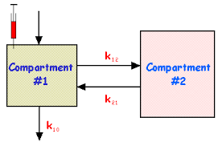
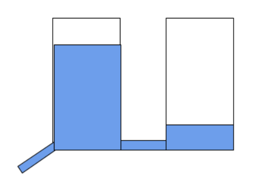
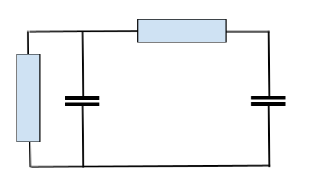

```{r setup, include=FALSE}
knitr::opts_chunk$set(echo = FALSE)
```

------------------------------------------------------------------------

### Agenda

-   Round of introduction
-   [Install R and RStudio]
-   [Introduction to R]
-   [R Lab](./R/R_lab.R)
-   Q & A
-   Coffee Break
-   [SIR Model]
-   [SIR Model in RStudio]
-   [Background on Differential Equations]
-   Q & A

------------------------------------------------------------------------

### Install R and RStudio

-   download R from r-project.org [<http://cran.at.r-project.org/>]
-   download RStudio Desktop from rstudio.org [<http://www.rstudio.com/ide/download/>]
-   install both R and RStudio
-   test successful installation with:

``` r
demo(graphics)
```

------------------------------------------------------------------------

### Introduction to R

```{r echo=TRUE}
x = rnorm(12, mean = -5)
x 
mean(x)
summary(x)
# Draw a histogram
hist(x)
# with more values
hist(rnorm(1000000,mean=4),breaks=100,col="red")
```

------------------------------------------------------------------------

### Working on the R command-line

-   \^ v arrow keys to navigate your command history
-   \<- -\> arrow keys to edit the command-line
-   you can save the command history:

```         
history()
```

-   TAB for object/file completion

```         
df = read.csv("data   ")
```

------------------------------------------------------------------------

### 1.1 Expressions

```{r echo=TRUE}
2+3
4*5
3^(1/2)
2^8
```

R **evaluates** these expressions, i.e. determines the **value** of these expressions

------------------------------------------------------------------------

### 1.2 Expressions evaluating to logical values

```{r echo=TRUE}
2 < 3   
1 > 10  
5 == 5   
5 != 5
```

------------------------------------------------------------------------

Short for **TRUE** and **FALSE**

```{r echo=TRUE}
T
F
```

------------------------------------------------------------------------

### 1.3 Variables

Every variable has a **name** and a **type**.

R has the following data types: **character**, **numeric**, **integer** and **logical**.

The name of a variable may contain

-   letters (upper/lower case matters)
-   digits
-   periods
-   underscores and
-   should start with a letter

------------------------------------------------------------------------

Variables do not need to be declared first.

A variable is assigned a value in an 'assignment' statement (in addition to **=** it is possible to use **\<-** as assignment operator)

```{r echo=TRUE}
x = 200
half.x  =  x/2
half.x
y <- 12.3
y 
```

------------------------------------------------------------------------

### 1.3.1 character

The class() function is used to lookup the type of a variable.

```{r echo=TRUE}
firstName = "John"
class(firstName)
firstName
```

------------------------------------------------------------------------

### 1.3.2 numeric

```{r echo=TRUE}
heightInCm = 178.2
class(heightInCm)
heightInCm
```

------------------------------------------------------------------------

### 1.3.3 integer

```{r echo=TRUE}
numberOfChildren = 2
class(numberOfChildren)
numberOfChildren = 2L # number of children should be integer
class(numberOfChildren)
numberOfChildren
```

------------------------------------------------------------------------

### 1.3.4 logical

```{r echo=TRUE}
RisFun = T
class(RisFun)
RisFun
```

------------------------------------------------------------------------

### 1.3.5 Casting (coercion)

"as" can be used to cast to a different type:

```{r echo=TRUE}
y = as.integer(3.9)
class(y)
y # the value of y is truncated
x = as.character(33)
class(x)
x
```

------------------------------------------------------------------------

### 1.4 Functions

A function can be called with the name of the function followed by the arguments of the function:

```{r echo=TRUE}
max(9,3,4,2,11,2)
sum(2,3,4)
prod(5,6,7)
```

------------------------------------------------------------------------

### 1.5 Help

```         
? sum
?? product
```

------------------------------------------------------------------------

### 1.6 Files

-   dir() shows the files in the working directory
-   ls() shows the variables defined

```         
dir()
ls()
```

------------------------------------------------------------------------

### 2.1 Vectors: what is a vector?

A vector is an ordered collection of values of the same type

```{r echo=TRUE}
lengths = c (178.2, 180.2, 177.4) ## c for "combine"
lengths
firstNames = c ("John","Peter","James","Mary")
firstNames
```

Vector of length 1

R works with vectors by default.\
A variable with one value is a vector of length 1.

```{r echo=TRUE}
x = c(10,20,30)
x
length(x) 
y = 33
length(y)
y[1]
```

------------------------------------------------------------------------

### 2.2 Sequence vectors

```{r echo=TRUE}
z = 1:10
z
z = seq(1,5)
z = seq(from=1,to=5,by=1/3)
z
9:5

```

------------------------------------------------------------------------

### 2.3 Vectors: selecting elements

```{r echo=TRUE}
x = 100:120
x[1]           ## the first element is element nr 1 (not 0 as in C or Python!!) 
x[c(12,14)]    ## elements 12 and 14
x[1:5]         ## elements 1 thru 5
x[-c(1,3,5,7)] ## excludes elements 1, 3, 5 and 7 
```

------------------------------------------------------------------------

### 2.4 Vectors: assigning values to elements

```{r echo=TRUE}
x = rep(0,10)
x [1: 3] = 2
x [5: 6] = c(5,NA)
x [7:10] = c(1,9)
x
```

------------------------------------------------------------------------

### 2.5 Vectors: indexing elements by name

```{r echo=TRUE}
cc = c(1200,1800,3500)
names(cc)=c("VW Polo","MG B","Rover V8")
cc["MG B"]
```

------------------------------------------------------------------------

### 2.6 Vectors: plotting element values

```{r echo=TRUE}
cc = c(1200,1800,3500)
names(cc)=c("VW Polo","MG B","Rover V8")
barplot(cc)
```

------------------------------------------------------------------------

### 2.7 Computation with vectors

```{r echo=TRUE}
a = c(1,2,3) ; a = a + 1
a
a = 1:3 ; b = 4:2 ; c = a + b
c
c/5
```

------------------------------------------------------------------------

### 2.8 Comparing vectors

```{r echo=TRUE}
a = c(1,2,3)
b = c(4,2,5)
a == b
```

The result is a vector of T/F values i.e. a logical vector \*\*\*\*\* \### 2.9 Logical vectors

If a vector is compared to a single value all elements of that vector are compared; the result is a logical vector:

```{r echo=TRUE}
x = 1:5
x>2
```

------------------------------------------------------------------------

A logical vector can be used to select elements of the original vector:

```{r echo=TRUE}
x = 1:5
select = x>2
x[select]
```

in SQL: SELECT \* FROM NUMBERS WHERE x\>2; \*\*\*\*\* \### 2.9 Logical vectors: more examples

```{r echo=TRUE}
x = 1:10
gt5 = (x > 5)
lt8 = (x < 8)
x[gt5 & lt8]
```

Use & (not &&) as 'short-circuit' boolean operators may have unexpected effects in R !! \*\*\*\*\*

```{r echo=TRUE}
lt5 = (x < 5)
gt8 = (x > 8)
x[lt5 | gt8]
```

Use \| (not \|\|)

### 2.10 Applying functions to vectors

```{r echo=TRUE}
z = c(9,49,16,36)
min(z)
range(z)
sqrt(z)
sum(z)
summary(z)
```

------------------------------------------------------------------------

### 2.11 Often used functions with vectors

```         
length()
rev()
sum(), cumsum(), prod(), cumprod()
mean(), sd(), var(), median()
min(), max(), range(), summary()
exp(), log(), sin(), cos(), tan()
round(), ceil(), 
floor(), signif()
sort(), order(), rank()
which(), which.max()
any(), all()
```

------------------------------------------------------------------------

### 2.12 Scatter plots

```{r echo=TRUE}
x = -5:5
y = x^2
plot(x,y)
```

------------------------------------------------------------------------

### 2.13 NA (Not Available)

NA indicates that a value is not available (cf NULL in SQL)

```{r echo=TRUE}
barplot(c(25,NA,20))
```

------------------------------------------------------------------------

'Missing values' are denoted with NA NA cannot be compared with other values

```{r echo=TRUE}
c(25,NA,20) == c(25,25,25)
# NA == NA # neither with itself...
is.na(NA) # the function is.na() is used to test if a value equals NA
```

------------------------------------------------------------------------

### 3.1 Matrices

Matrices have 2 dimensions

```{r echo=TRUE}
m1 = matrix(9,nrow=3,ncol=3)
m2 = matrix(c(11:14,21:24),nrow=2,ncol=4,byrow=T)
m2
```

------------------------------------------------------------------------

### 3.2 Selecting elements of a matrix

```{r echo=TRUE}
# a single element
m2[1,3]

# selecting a column 
m2[,1]

# selecting a row
m2[2,]
```

------------------------------------------------------------------------

### 3.3 Plotting matrix values

```{r echo=TRUE}
height=matrix(1,10,10)
height[4:6,4:6]=5
height
```

------------------------------------------------------------------------

```{r echo=TRUE}
height=matrix(1,10,10)
height[4:6,4:6]=5
contour(height)
```

------------------------------------------------------------------------

```{r echo=TRUE}
height=matrix(1,10,10)
height[4:6,4:6]=5
persp(height,expand=0.2)
```

------------------------------------------------------------------------

### 4.1 Calling R functions

```         
? read.csv 
read.csv(file, header = TRUE, sep = ",", quote="\"", dec=".", fill = TRUE, comment.char="", ...)   
# valid ways to call a function:
read.csv("data.csv",F)            # correct
read.csv(file="data.csv",header=F)# clear
read.csv("data.csv",F,";")        # correct
read.csv(file="data.csv",header=F,sep=";") # clear
read.csv("data.csv",";")          # error!
read.csv("data.csv",sep=";")      # correct
```

------------------------------------------------------------------------

### 4.2 Writing R functions

```{r echo=TRUE}
mult = function(a,b){
  a*b # the same as return(a*b)
}
mult(5,6)
```

------------------------------------------------------------------------

### 4.3 Scope in functions

```{r echo=TRUE}
a = 1
f = function(x){
  a = 2*a
  x+a
}
f(3)
a
```

------------------------------------------------------------------------

```{r echo=TRUE}
g = function(x){
  x = x+3
  x
}
a=1:3
g(a)
a
```

------------------------------------------------------------------------

### 4.3 Scope in functions

-   Functions in R don't have unexpected 'side-effects'.

-   When you write a function: pretend to be living in the body of the function, where only data is available that is passed through the function arguments and where you can only pass a value to the outside world through the return value...

-   This means that any result of a function should be passed as a return value...

-   This is not a problem as a combination of values can be passed as a list e.g. list(a,b,x)

------------------------------------------------------------------------

### 5.1 Data frames

Multiple (column) vectors possibly of different types, all of the same lengths

```{r echo=TRUE}
vector1 = c(178.2, 180.2, 177.4, 166.2)
vector2 =  c("John","Richard","Peter","Sophie")
myDataFrame = data.frame(heights=vector1,firstNames=vector2)
myDataFrame
```

------------------------------------------------------------------------

### 5.2 Data frames - subsetting

```{r echo=TRUE}
myDataFrame[1,1:2]
myDataFrame$firstNames
```

------------------------------------------------------------------------

#### 5.3 Data frames - logical subsetting

```{r echo=TRUE}
myDataFrame[myDataFrame$firstNames=="John",]
myDataFrame[myDataFrame$heights < 170,]
```

------------------------------------------------------------------------

### 6.1 Lists

A vector with values of different types

```{r echo=TRUE}
p = list(temp=-5,precipitation="snow",sunny=T)
p
p[[1]]
p[["precipitation"]]
p$precipitation
```

-   Use TAB completion!
-   Use lists primarily for returning multiple types of values from a function
-   Lists are not always easy to use

------------------------------------------------------------------------

### 7. Factors

Qualitative variables used in models

```{r echo=TRUE}
smoker = c("yes","no","yes","yes")
smokerFactor = as.factor(smoker)
smokerFactor
```

A factor contains data indexed by its 'levels' i.e. an enumeration of the values

```{r echo=TRUE}
delay = c(1,2,2,7,3,2,3,9,1,1,2,3,6,6,5,4,32,2)
factor(delay)
table(factor(delay))
```

------------------------------------------------------------------------

```{r echo=TRUE}
delay = c(1,2,2,7,3,2,3,9,1,1,2,3,6,6,5,4,32,2)
barplot(table(factor(delay)))
```

------------------------------------------------------------------------

### 8. Summary Statistics

### 8.1 Mean

```{r echo=T}
x = c(178.2, 180.2, 177.4)
mean(x)
```

Mean is defined as: $\bar{x} = \frac{1}{n} \sum_{i=1}^{n} x_{i}$

------------------------------------------------------------------------

### 8.2 Median

```{r echo=T}
a = c(1,2,3,4,5)
mean(a); median(a)
a[5]=20
mean(a); median(a)
```

------------------------------------------------------------------------

### 8.3 Standard Deviation

Standard deviation is defined as

$$ \sigma = \sqrt{\frac{ \sum (x_{i} - \bar{x})^2}{n}} $$

```{r echo=T}
a = c(1,2,3,4,5)
sd(a)
```

------------------------------------------------------------------------

### 8.4 Variance

Variance is defined as

$$ \sigma^2 = \frac{ \sum (x_{i} - \bar{x})^2}{n} $$

```{r echo=T}
a = c(1,2,3,4,5)
var(a)
sd(a)==sqrt(var(a))
```

------------------------------------------------------------------------

#### 9. Naming conventions

Variable names should be short and speficic. Examples of often used styles:

**Camel caps**

```         
myHeightCM = 188
```

**Underscore**

```         
my_height_cm = 188
```

**Dot separated**

```         
my.height.cm = 188
```

------------------------------------------------------------------------

### 10. Style guides

-   <http://4dpiecharts.com/r-code-style-guide/>
-   <http://google-styleguide.googlecode.com/svn/trunk/google-r-style.html>
-   <http://wiki.fhcrc.org/bioc/Coding_Standards>

------------------------------------------------------------------------

### 11. References

[A free R course at Cognitive Class AI (IBM)](https://cognitiveclass.ai/courses/r-101)

[More advanced: my favorite book on Statistical Learning with R (free pdf ; Labs in R with Introduction to R in the 1st chapter)](https://www.statlearning.com/)

[Videos and slides of an excellent course accompanying Introduction to Statistical Learning (1st Ed) by Hastie and Tibshirani](https://www.dataschool.io/15-hours-of-expert-machine-learning-videos/)

[Free course at edX of of the 2nd Ed of Introduction to Statistical Learning (2nd Ed) by Hastie and Tibshirani](https://www.edx.org/course/statistical-learning)

[Slides of the course Introduction to Data Science with R by Garrett Grolemund (RStudio)](https://github.com/rstudio/Intro/tree/master/slides)

[Coursera Data Science Specialization](https://www.coursera.org/specialization/jhudatascience/1?utm_medium=listingPage)

[Data Science Specialization Community Site](http://datasciencespecialization.github.io/)

[O'Reilly Data](http://www.oreilly.com/data/)

[Try R at Code School](http://tryr.codeschool.com/)

------------------------------------------------------------------------

### SIR model

The basic model to study infectious disease dynamics is the SIR model.\
The population is divided into 3 groups:

-   S : susceptible
-   I : infectious\
-   R : removed

[Note that S, I and R are numbers of people, not fractions]

Differential equations: $$
\begin{align}
\frac{\partial S}{\partial t} &= −b\cdot c\cdot \frac{I}{N} \cdot S \\
\frac{\partial I}{\partial t} &= b\cdot c\cdot \frac{I}{N} \cdot S - \frac{I}{d} \\
\frac{\partial R}{\partial t} &= \frac{I}{d}
\end{align}
$$ with\
$N=S+I+R$

and\
$b$: transmission probability per contact\
$c$: contact rate (the number of contacts per unit time)\
$d$: duration of the infectious period

An epidemic will develop if $\frac{\partial I}{\partial t} > 0$ i.e. if $b \cdot c \cdot d >1$ (provided that $I>0$ and $\frac{S}{N} = 1$)

The so called $R_0 = b \cdot c \cdot d$ is the number of secondary infections resulting from a single infectious person in a totally susceptible population (i.e when $S = N−1$ en $I = 1$).

The epidemic will stop spreading when $R_t = b \cdot c \cdot d \cdot \frac{S_{t-1}}{N_{t-1}} < 1$ i.e. when $\frac{S_{t-1}}{N_{t-1}} < \frac{1}{b \cdot c \cdot d} = \frac{1}{R_0}$ or equivalently when $\frac{I_{t-1}+R_{t-1}}{N_{t-1}} > \frac{R_0-1}{R_0}$ which shows that a higher fraction of the population needs to be immune (e.g. vaccinated) when the $R_0$ is higher.

An epidemic will not (further) develop if $b$ (e.g. washing hands frequently, keeping distance, face masks) is reduced and/or $c$ (contact rate) is reduced.

Note that the effect of reducing e.g. the contact rate $c$ could result in the development of strains (due to selection pressure and evolution) that are more contagious (i.e. increased $b$) or that cause an increase in $d$.\
In short: a new virus strain could have a higher $b$ and/or $d$ to compensate for the decreased contact rate $c$ ; a longer duration of the infectious period $d$ usually means less virulent / deadly.

------------------------------------------------------------------------

### SIR model in RStudio

1.  Open RStudio
2.  Install the **`deSolve`** R package
3.  Open the file [SIR_model.R](./R/SIR_model.R)
4.  Run the code
5.  Experiment with parameters to reduce or increase the $R_0$
6.  (if time allows) Rewrite the equations and modify the code to\
    express `s`, `i` and `r` as fractions i.e. $\text s = \frac S N$ ; $\text i = \frac I N$ ; $\text r = \frac R N$

------------------------------------------------------------------------

### Background on differential equations

**What is a differential equation?**

Definition:

***an equation that defines the relationship between a function and its derivatives***

Which is kind of abstract ....

We will limit ourselves to first derivatives and use time as the independent variable:

$$\frac {\partial y} {\partial t} = k \cdot y$$

with $y$ we actually mean $y(t)$ i.e. $y$ as a function of time ; we use $y$ as a short notation; so in fact:

$$\frac {\partial y(t)} {\partial t} = k \cdot y(t)$$

What does this mean?

At any moment in time the first derivative of $y$ versus time (i.e. *the rate of change in* $y$) equals a constant $k$ times the value of $y$ at that moment.

We are looking for a function $y(t)$ that satisfies this condition (i.e. this differential equation).

------------------------------------------------------------------------

### Flowfield of $$\frac {\partial y(t)} {\partial t} = k \cdot y(t)$$

Before trying to find a solution to the differential equation, we can get an impression about the\
time behavior by looking at the 'flow field' i.e. the derivative (slope of the tangent) of the\
(unknown) function; in this case for $$\frac {\partial y(t)}{\partial t} = - y(t)$$

```{r echo=F}
library(phaseR)

dy = function(t,y,parameters){
  k = parameters[1]
  k * y
}
expdecay  <- flowField(dy,xlim = c(0,2), ylim = c(0, 2),
                                 parameters = -1,
                                 points     = 21,
                                 system     = "one.dim",
                                 add        = FALSE)
```

------------------------------------------------------------------------

### Solution of $\frac {\partial y(t)}{\partial t} = k \cdot y(t)$

In this case the differential equation $\frac{\partial y(t)}{\partial t} = k \cdot y(t)$ has an analytic solution.

From high school we may remember that the $\frac{\partial }{\partial t}e^t = e^t$ and that $\frac{\partial }{\partial t}e^{k \cdot t} = k \cdot e^{k \cdot t}$

Therefore $y(t) = e^{k \cdot t}$ satisfies our differential equation

In fact any function $y(t) = y(0) \cdot e^{k \cdot t}$ is a solution with $y(0)$ the value of $y$ at $t=0$ i.e. the initial condition.

See also <https://personal.math.ubc.ca/~keshet/OpenBook.pdf> (book by Edelstein-Keshet)\
chapter 11: *Differential equations for exponential growth and decay* for theory and background.

[<https://epubs.siam.org/doi/book/10.1137/1.9780898719147> is slightly more advanced and my favorite book on this subject ; also by Edelstein-Keshet]

------------------------------------------------------------------------

### Simulation

Unfortunately ( ? :-) many differential equations cannot be solved analytically....

In that case we can integrate a system of differential equations numerically i.e. simulate the time behavior using numerical methods.

This comes down to:

1.  start with an initial value at time $t=0$: $y(0) = 1$
2.  calculate $\frac{\partial y(t)}{\partial t} = k \cdot y(t)$
3.  with e.g. $k = -0.6$: $\frac{dy(0)}{dt} = -0.6 * 1 = -0.6$
4.  calculate $y$ at time $t+h$ (where $h$ is a small time step for instance $0.2$): $y(t+h) = y(0)+ h \cdot \frac{\partial y(0)}{\partial t} = 1 + 0.2 \cdot -0.6 = 0.88$
5.  next, calculate $y(t+2\cdot h)$:\
    $y(t+2\cdot h) = y(t+h) + h \cdot \frac{dy(t+h)}{dt} = 0.88 + 0.2 \cdot -0.6 \cdot 0.88 = 0.7744$

etcetera .....

Of course, it is more convenient to write a couple of R functions:

```{r echo=T}
dy = function(y,k){
  k*y
}
euler = function(f,y0,k,times){
  n = length(times)
  h = times[2]-times[1]
  y = 0*(1:n)
  t = 0 
  y[1]=y0
  for (i in 2:n)
    y[i] = y[i-1]+h*f(y[i-1],k) 
  y
}
t = seq(0,3,0.2)
y0=1 ; k = -1
y = euler(dy,y0,k,t)
plot(t,y,type="l",col="red",lwd=1, ylim=c(0,1),xlim=c(0,3))
lines(t,y0*exp(k*t),col="blue",lwd=2)
```

------------------------------------------------------------------------

### Examples of processes described by simple differential equations

Pharmacokinetics: removal of a substance from the circulation by the kidney (glomerular filtration).\
In fact, this is slightly more complicated (two coupled 1st order diff eqs):

$\frac{\partial c1}{\partial t} = -k10*c1 + k21*c2$\
$\frac{\partial c2}{\partial t} = k12*c1$







Note that the differential equations for these 3 systems are identical. Also, the differential equations can be solved analytically using standard methods.

------------------------------------------------------------------------

### Significance of a compartment with a fixed rate of removal

In a standard S(E)IR model, disease progression is defined as:

$$\frac{\partial I}{\partial t} = \frac{-I}{d}$$

with d the duration of the infectious period (i.e. a removal rate of $\frac 1 d$)

This means that although the average duration of disease equals $d$, $63 \%$ $\left (\frac 1 e \right)$ of the people in disease stage $I$ would have moved out in a time period shorter than $d$. The residence time is exponentially distributed (cf a Poisson process with a fixed probability of an event per unit time). This is very different from e.g. a normal distribution. Also, infectious diseases are usually modeled as Markov processes, which means that the change in state only depends on the current state (i.e. there is no memory).
