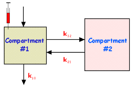
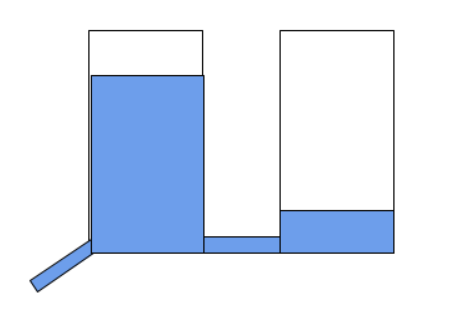
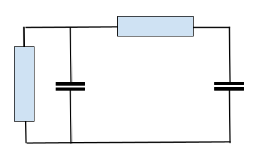

```{r setup, include=FALSE}
knitr::opts_chunk$set(echo = FALSE)
```

## Agenda

1. SIR model 
2. SIR model in RStudio
3. Background on differential equations

*****

## SIR model

The basic model to study infectious disease dynamics is the SIR model.  
The population is divided into 3 groups:

- S : susceptible 
- I : infectious  
- R : removed  

[Note that S, I and R are numbers of people, not fractions]

Differential equations:
$$
\begin{align}
\frac{\partial S}{\partial t} &= −b\cdot c\cdot \frac{I}{N} \cdot S \\
\frac{\partial I}{\partial t} &= b\cdot c\cdot \frac{I}{N} \cdot S - \frac{I}{d} \\
\frac{\partial R}{\partial t} &= \frac{I}{d}
\end{align}
$$
with  
$N=S+I+R$

and  
$b$: transmission probability per contact  
$c$: contact rate (the number of contacts per unit time)  
$d$: duration of the infectious period  

An epidemic will develop if $\frac{\partial I}{\partial t} > 0$ i.e. if $b \cdot c \cdot  d >1$ (provided that $I>0$ and $\frac{S}{N} = 1$)

The so called $R_0 = b \cdot c \cdot  d$ is the number of secondary infections resulting from a single infectious person in a totally susceptible population (i.e when  $S = N−1$ en $I = 1$).

The epidemic will stop spreading when $R_t = b \cdot c \cdot  d \cdot \frac{S_{t-1}}{N_{t-1}} < 1$ i.e. when $\frac{S_{t-1}}{N_{t-1}} < \frac{1}{b \cdot c \cdot d} = \frac{1}{R_0}$ or equivalently when $\frac{I_{t-1}+R_{t-1}}{N_{t-1}} > \frac{R_0-1}{R_0}$ which shows that a higher fraction of the population needs to be immune (e.g. vaccinated) when the $R_0$ is higher.

An epidemic will not (further) develop if $b$ (e.g. washing hands frequently, keeping distance, face masks) is reduced and/or $c$ (contact rate) is reduced.

Note that the effect of reducing e.g. the contact rate $c$ could result in the development of strains (due to selection pressure and evolution) that are more contagious (i.e. increased $b$) or that cause an increase in $d$.  
In short: a new virus strain could have a higher $b$ and/or $d$ to compensate for the decreased contact rate $c$ ; a longer duration of the infectious period $d$ usually means less virulent / deadly.

*****

## Assignment

1. Open RStudio
2. Install the **`deSolve`** R package
3. Open the file **`SIR_model.R`**
4. Run the code
5. Experiment with parameters to reduce or increase the $R_0$
6. (if time allows) Rewrite the equations and modify the code to   
   express `s`, `i` and `r` as fractions i.e. $\text s = \frac S N$ ; $\text i = \frac I N$ ; $\text r = \frac R N$

*****


## What is a differential equation?

Definition:

**an equation that defines the relationship between a function and its derivatives**

Which is kind of abstract ....

We will limit ourselves to first derivatives and use time as the independent variable:

$$\frac {\partial y} {\partial t} = k \cdot y$$

with $y$ we actually mean $y(t)$ i.e. $y$ as a function of time ; we use $y$ as a short notation; so in fact:

$$\frac {\partial y(t)} {\partial t} = k \cdot y(t)$$

What does this mean?

At any moment in time the first derivative of $y$ versus time (i.e. *the rate of change in* $y$) equals a constant $k$ times the value of $y$ at that moment.

We are looking for a function $y(t)$ that satisfies this condition (i.e. this differential equation).


## Flowfield of $$\frac {\partial y(t)} {\partial t} = k \cdot y(t)$$

Before trying to find a solution to the differential equation, we can get an impression about the  
time behavior by looking at the 'flow field' i.e. the derivative (slope of the tangent) of the  
(unknown) function; in this case for $$\frac {\partial y(t)}{\partial t} = - y(t)$$


```{r echo=F}
library(phaseR)

dy = function(t,y,parameters){
  k = parameters[1]
  k * y
}
expdecay  <- flowField(dy,xlim = c(0,2), ylim = c(0, 2),
                                 parameters = -1,
                                 points     = 21,
                                 system     = "one.dim",
                                 add        = FALSE)
```


## Solution of $\frac {\partial y(t)}{\partial t} = k \cdot y(t)$

In this case the differential equation $\frac{\partial y(t)}{\partial t} = k \cdot y(t)$ has an analytic solution.

From high school we may remember that the $\frac{\partial }{\partial t}e^t = e^t$ and that $\frac{\partial }{\partial t}e^{k \cdot t} = k \cdot e^{k \cdot t}$

Therefore $y(t) = e^{k \cdot t}$ satisfies our differential equation

In fact any function $y(t) = y(0) \cdot e^{k \cdot t}$ is a solution with $y(0)$ the value of $y$ at $t=0$ i.e. the initial condition.

See also https://personal.math.ubc.ca/~keshet/OpenBook.pdf (book by Edelstein-Keshet)  
chapter 11: _Differential equations for exponential growth and decay_ for theory and background. 

[https://epubs.siam.org/doi/book/10.1137/1.9780898719147 is slightly more advanced and my favorite book on this subject ; also by Edelstein-Keshet]

## Simulation

Unfortunately ( ? :-) many differential equations cannot be solved analytically....

In that case we can integrate a system of differential equations numerically i.e. simulate the time behavior using numerical methods.

This comes down to:

1.  start with an initial value at time $t=0$: $y(0) = 1$
2.  calculate $\frac{\partial y(t)}{\partial t} = k \cdot y(t)$
3.  with e.g. $k = -0.6$: $\frac{dy(0)}{dt} = -0.6 * 1 = -0.6$
4.  calculate $y$ at time $t+h$ (where $h$ is a small time step for instance $0.2$):
    $y(t+h) = y(0)+ h \cdot \frac{\partial y(0)}{\partial t} = 1 + 0.2 \cdot -0.6 = 0.88$
5.  next, calculate $y(t+2\cdot h)$:\
    $y(t+2\cdot h) = y(t+h) + h \cdot \frac{dy(t+h)}{dt} = 0.88 + 0.2 \cdot -0.6 \cdot 0.88 = 0.7744$

etcetera .....

*****
Of course, it is more convenient to write a couple of R functions:

```{r echo=T}
dy = function(y,k){
  k*y
}
euler = function(f,y0,k,times){
  n = length(times)
  h = times[2]-times[1]
  y = 0*(1:n)
  t = 0 
  y[1]=y0
  for (i in 2:n)
    y[i] = y[i-1]+h*f(y[i-1],k) 
  y
}
t = seq(0,3,0.2)
y0=1 ; k = -1
y = euler(dy,y0,k,t)
plot(t,y,type="l",col="red",lwd=1, ylim=c(0,1),xlim=c(0,3))
lines(t,y0*exp(k*t),col="blue",lwd=2)
```

*****
## Examples of processes described by simple differential equations


Pharmacokinetics: removal of a substance from the circulation by the kidney (glomerular filtration).  
In fact, this is slightly more complicated (two coupled 1st order diff eqs):

$\frac{\partial c1}{\partial t} = -k10*c1 + k21*c2$  
$\frac{\partial c2}{\partial t} =  k12*c1$  

 






Note that the differential equations for these 3 systems are identical.
Also, the differential equations can be solved analytically using standard methods.


## Significance of a compartment with a fixed rate of removal

In a standard S(E)IR model, disease progression is defined as:

$$\frac{\partial I}{\partial t} = \frac{-I}{d}$$

with d the duration of the infectious period (i.e. a removal rate of $\frac 1 d$)

This means that although the average duration of disease equals $d$, 
 $63 \%$ $\left (\frac 1 e \right)$ of the people in disease stage $I$ would have moved out in a time period shorter than $d$. The residence time is exponentially distributed (cf a Poisson process with a fixed probability of an event per unit time). 
This is very different from e.g. a normal distribution.
Also, infectious diseases are usually modeled as Markov processes, which means
that the change in state only depends on the current state (i.e. there is no memory).


